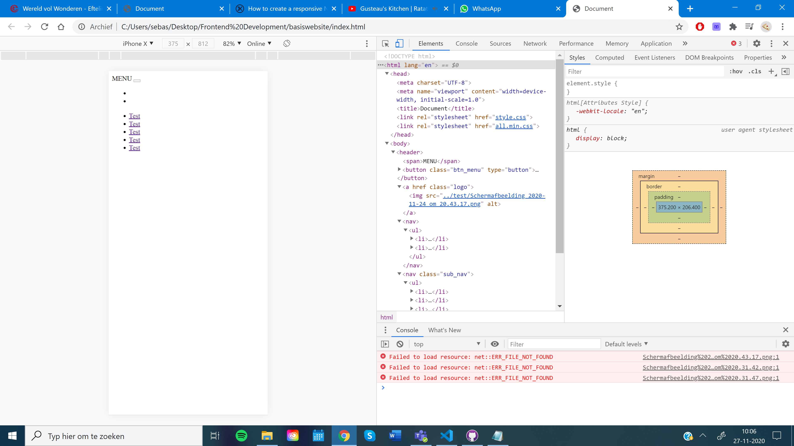
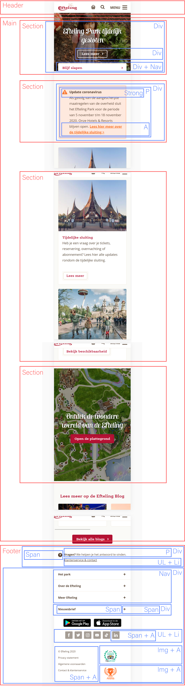

# Procesverslag
**Auteur:** Sebas van de Munt, Klas 206b, 500789096

Markdown cheat cheet: [Hulp bij het schrijven van Markdown](https://github.com/adam-p/markdown-here/wiki/Markdown-Cheatsheet). Nb. de standaardstructuur en de spartaanse opmaak zijn helemaal prima. Het gaat om de inhoud van je procesverslag. Besteedt de tijd voor pracht en praal aan je website.

## Bronnenlijst
1. https://css-tricks.com/almanac/ - Selectors en Properties die ik niet uit m'n hoofd weet
2. https://www.youtube.com/watch?v=F-mvXKKoSCU&ab_channel=CodeSpot - Hamburger Menu
3. https://www.youtube.com/watch?v=tb_EwQOa_ao&ab_channel=CodeInstinct - Banner Images
4. https://www.youtube.com/watch?v=f4J3uaNNYTE&ab_channel=CodingNepal - Footer
5. https://css-tricks.com/look-ma-no-media-queries-responsive-layouts-using-css-grid/ - grids!

## Eindgesprek (week 7/8)

-dit ging goed & dit was lastig-

**Screenshot(s):**

-screenshot(s) van je eindresultaat-

## Voortgang 3 (week 6)

-same as voortgang 1-

## Voortgang 2 (week 5)

-same as voortgang 1-
### Stand van zaken
Er is heel veel gebeurd, en er staat al flink wat content op de website. De code is echter nog heel erg slordig en niet heel semantisch.
Tot nu toe is alleen de eerste pagina gebouwd, er is nog niks gebeurd aan de tweede pagina. Ik ben veel tutorials aan het volgen en aan het experimenteren.
Helaas gaat het coderen een stuk langzamer dan ik had gehoopt!

-dit ging goed & dit was lastig-

**Screenshot(s):**

De content staat er en de stijling is half, alles behalve een paar kleine dingen moet nog responsive voor mobile first.

### Verslag van meeting

-na afloop snel uitkomsten vastleggen-

Ik heb een (to-do) lijstje gemaakt van alle feedback die ik ga verwerken voordat ik verder ga "bouwen";
- ID's die niet nodig zijn weghalen
- Header in HTML opschonen
- Sowieso de gehele website opschonen voordat ik aan mijn tweede pagina kan beginnen
- .inner-container kan anders, door absolute schaalt de afbeelding niet. Dit kan opgelost worden met flexbox.
- absolute wordt eigenlijk voor menu's gebruikt
- de div's bij de contentblokken moeten articles worden
- h3 ipv h2 bij de contentblokken
- De afbeeldingen in de contentblokken moeten samen gestijld worden
- De buttons moeten ook samen gestijld worden
- Buttons naar andere pagina's zijn geen buttons, maar links
- Bij de Efteling blog content moeten de h2, h3, h4's naar p's gaan
- het font moet ik via Google Fonts toevoegen
- Ik moet kunnen uitleggen waarom ik * gebruik
- Ik maak veel gebruik van px, dit moet em worden
- px bij border-radius is wel oké omdat dit heel specifiek is
- linear-gradient moet over de hero afbeelding heen in een aparte div
- .Coronavirus moet een "evergreen" naam krijgen
- De footer CSS kan véél netter
- Het gebruik van min-width > max-width
- Javascript mag niet inline in de HTML, alles hiervoor moet volledig in het Javascript document staan

## Voortgang 1 (week 3)

### Stand van zaken
Ik ben al twee keer opnieuw begonnen, met de verkeerde aanpak.
Mijn aanpak was, de HTML en CSS van de Efteling website inspecteren, onderzoeken en analyseren, en deze zo goed mogelijk na proberen te bouwen.
Dit bleek een bijzonder slechte aanpak te zijn, omdat de Efteling website veel ingewikkelder in elkaar zit dan ik me tot hiervoor had kunnen verbeelden.

De code die ik meenam naar dit voortganggesprek, was mijn derde poging.
Deze code was erg karig, vanwege tijdgebrek door alle restarts, met alleen elementen en stijling voor het header balkje.
Maar, mijn aanpak is nu wel beter. Ik bekijk de Efteling website en bouw het stukje voor stukje na met gebruik van andere bronnen en online tutorials.

-dit ging goed & dit was lastig-

**Screenshot(s):**

-screenshot(s) van hoe ver je bent met korte uitleg-

Zoals eerder al vermeld, is het allemaal nog erg karig. Maar de basis ligt er in ieder geval, dus het is niet he-le-maal bagger!

### Agenda voor meeting

-samen met je groepje opstellen-

| student 1      | student 2          | student 3    | student 4        |
| ---            | ---                | ---          | ---              |
| dit bespreken  | en dit             | en ik dit    | en dan ik dat    |
| an dat ook nog | dit als er tijd is | nog een punt | dit wil ik zeker |
| ...            | ...                | ...          | ...              |

### Verslag van meeting

-na afloop snel uitkomsten vastleggen-
De nieuwe aanpak van dingen met tutorials na proberen te bouwen is goed, en had ik veel eerder moeten doen. Gelukkig is er nog wat tijd.
Ik moet me eerst gaan focussen op de elementen op de website krijgen en deze stijlen. Daarna moet ik na gaan denken over interactieve dingen,
zoals het hamburgermenu aan de rechterkant. Mijn bronnen moet ik goed bij gaan houden en het stijlen van de website kan ik slim aanpakken,
omdat de efteling veel van dezelfde elementen herbruikt.

## Breakdownschets (week 1)

-uitwerken voor de 1e werkgroep - eind van de eerste week-

## Intake (week 1)
-uitwerken voor de kick-off werkgroep - begin van de eerste week-

**Je startniveau:** Ik ga beginnen op de rode piste!

**Je focus:** Ik ga me focussen op responsiveness

**Je opdracht:** https://www.efteling.com/nl

**Screenshot(s) van de eerste pagina (small screen):**

**Screenshot(s) van de tweede pagina (small screen):**

